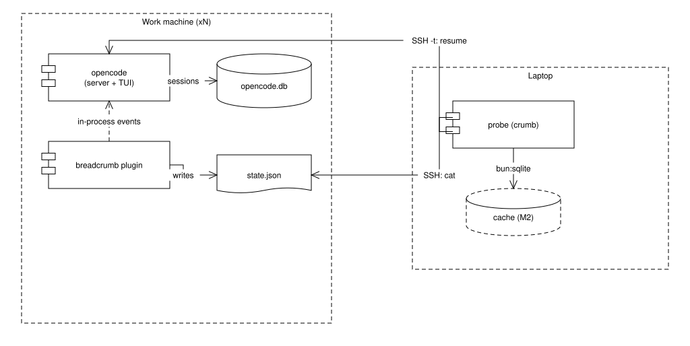
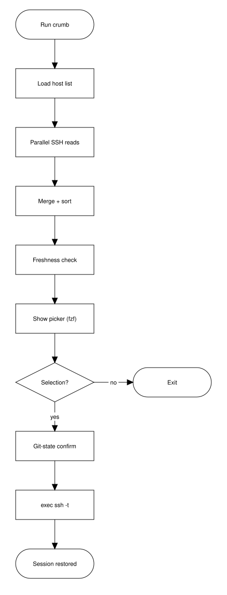

# Breadcrumb — Implementation Specification

Cross-machine capture and rehydration of opencode sessions, via an in-process plugin and an SSH-based probe.

| Field | Value |
|---|---|
| Document ID | BRC-SPEC-002 |
| Status | Draft |
| Version | 2.0 |
| Author(s) | TBD (project owner) |
| Reviewers | TBD |
| Last updated | 2026-09-05 |
| Supersedes | BRC-REQ-001 (requirements) v0.3 |

The key words MUST, MUST NOT, SHOULD, SHOULD NOT, and MAY in this document are to be interpreted as described in RFC 2119.

## 1. Overview

Breadcrumb records the context of opencode coding sessions across all of one owner's machines and lets the owner resume any session on its original machine from one laptop-side command. It has two build components: a plugin loaded into opencode on each machine that writes a small state file, and a probe on the laptop that reads those files over SSH, presents a picker, and resumes the chosen session over SSH.

This document is the implementation specification: it defines the state file format, the plugin behavior, the probe algorithm, the exact commands, the security model, and a phased build order (§13). It is self-contained; an implementer needs no other Breadcrumb document. Section 4 records the constraints inherited from the prior requirements document.

Figure 1 shows the two build components (shaded) against the software that already exists on each machine: the plugin sits inside opencode and writes `state.json`; the probe on the laptop reads that file over SSH and resumes sessions over SSH. The dashed cache is the M2 phase (§13).



Figure 1. Breadcrumb components and their placement. Source: `spec2-figure-1-components.drawio`.

opencode primer for implementers: opencode is a terminal AI coding agent. Launching `opencode` in a directory starts a local HTTP server (the brain: model calls, tool execution, state) plus a terminal UI (a thin client). Sessions are persisted per-directory to SQLite under `~/.local/share/opencode/`. `opencode -s <session_id>` relaunches into a saved session. opencode loads plugins (JS/TS) at startup and dispatches lifecycle events to them in-process; when opencode exits, the plugin stops with it.

## 2. Scope

In scope:

- A plugin that snapshots opencode session context (with git state) to a fixed-path state file.
- A probe CLI that aggregates state files over SSH, presents a picker, and resumes a session over SSH.
- An optional local cache and web timeline, specified as later phases (§13, M2–M3).

Out of scope:

- Any resident process or network listener on work machines (constraint C1, §4).
- Capture of non-opencode activity. Git-only and shell activity are out; shell history is served by Atuin independently and is not part of this system.
- Multi-user, sharing, or access control beyond a single owner using their own SSH credentials.
- Modifying opencode or reading opencode's SQLite internals during normal operation. The database is read only as a liveness cross-check (§7, FR-PROBE-070).
- Agent runtimes other than opencode.
- Automatic git mutation during resume (FR-RESUME-050).

## 3. Definitions

| Term | Definition |
|---|---|
| Plugin | The Breadcrumb TypeScript module loaded into opencode on each enrolled machine (§6). |
| Probe | The Breadcrumb CLI on the laptop, invoked as `crumb` (§7). |
| State file | `~/.local/share/breadcrumb/state.json`: a whole-file snapshot of a machine's recent sessions (§5). Not an event log. |
| Snapshot | One entry in the state file describing one session's most recent observed context. |
| Enrolled machine | A machine on which the plugin is installed and which the probe's host list names. |
| Host list | The probe's configuration: the set of SSH targets to read (§7, FR-PROBE-010). |
| Resume | Launching opencode on a machine, in a workspace, at a saved session, over SSH (§7.3). |
| Reference hardware | The owner's laptop and work machines; performance targets (§9) are measured there. |

## 4. Inherited constraints and decisions

These were fixed in the requirements phase and are carried here as givens.

| ID | Statement | Origin |
|---|---|---|
| C1 | No persistent network-listening opencode processes (`opencode serve`, `opencode web`) and no new listening services on work machines. SSH is the only inter-machine channel. | Owner |
| C2 | All enrolled machines are long-lived; none are routinely destroyed. Cross-machine transplant (cloning a repo elsewhere to resume) is therefore out of scope for this version. | Owner |
| C3 | Capture is opencode sessions plus their git state. Shell context is delegated to Atuin; standalone git events are not captured. | Owner |
| C4 | Resume operates on the original machine using the owner's own interactive SSH credentials. | Owner |
| C5 | Freshness is bounded by how often the owner runs the probe (pull model), with an on-demand run always available. There is no push and no background polling. | Follows from C1 |

## 5. State file format

The state file is the contract between plugin (writer) and probe (reader). It is a single JSON object at a fixed path, rewritten whole on each update (§6, FR-PLUGIN-040). It is a current-state snapshot, not an append log: an implementer must not add offsets, sequence numbers, or per-event history to it.

Path: `~/.local/share/breadcrumb/state.json` (resolve `~` to the plugin process's `$HOME`).

### 5.1 Top-level object

| Field | Type | Constraints | Description |
|---|---|---|---|
| schema | integer | = 1 | Format version. The probe MUST reject and warn on unknown values rather than misparse. |
| machine_id | string | non-empty; stable | Machine identity (IDN, §8). Survives hostname changes. |
| hostname | string | non-empty | Hostname at write time; display only. |
| written_at | string | RFC 3339 UTC | When this file was last written. Drives the liveness check (FR-PROBE-070). |
| plugin_version | string | semver | Plugin version that wrote the file; for the health view and debugging. |
| sessions | array | ≤ 200 entries | Recent session snapshots, newest-first (FR-PLUGIN-050). |

### 5.2 Session snapshot object

| Field | Type | Constraints | Description |
|---|---|---|---|
| session_id | string | non-empty | opencode session id, verbatim; the argument to `opencode -s`. |
| title | string \| null | — | Session title as reported by opencode. |
| directory | string | absolute path | Workspace the session ran in; the `cd` target on resume. |
| git_branch | string \| null | — | Branch at last observation; null if not a git repo or detached. |
| git_commit | string \| null | 40-hex or short | HEAD at last observation. |
| git_dirty | boolean | — | Whether the working tree had uncommitted changes at last observation. |
| updated_at | string | RFC 3339 UTC | Last observation time for this session; the probe's sort key. |

### 5.3 Example

```json
{
  "schema": 1,
  "machine_id": "b3f1c2a4-5e6d-7a8b-9c0d-1e2f3a4b5c6d",
  "hostname": "build-01",
  "written_at": "2026-09-05T14:22:31Z",
  "plugin_version": "0.1.0",
  "sessions": [
    {
      "session_id": "ses_9x82ndk3",
      "title": "fix ingress 502 on staging",
      "directory": "/home/dev/src/platform",
      "git_branch": "fix-ingress-502",
      "git_commit": "a1b2c3d4",
      "git_dirty": true,
      "updated_at": "2026-09-05T14:22:31Z"
    }
  ]
}
```

## 6. Component: plugin

The plugin is a single TypeScript module (§11, TECH-010) loaded into opencode on every enrolled machine. It observes session lifecycle events and rewrites the state file. It runs only while opencode runs, holds no socket, and starts no background work (satisfying C1). Requirements are grouped: observation (FR-PLUGIN-01x), snapshot construction (02x–03x), file write (04x–05x), and safety (06x).

| ID | Requirement | Priority | Verification |
|---|---|---|---|
| FR-PLUGIN-010 | The plugin MUST subscribe through opencode's general event hook rather than narrowly-named lifecycle hooks, because opencode silently ignores unrecognized hook names and those names have changed across versions. | MUST | Code review; integration test on the target opencode version |
| FR-PLUGIN-011 | The plugin MUST update the state file on session start and on session idle, and SHOULD update on session end. It MAY additionally update on message events, throttled per FR-PLUGIN-042. | MUST | Integration test |
| FR-PLUGIN-020 | For the active session the plugin MUST capture: session_id, title (when available), and directory, from the event and opencode plugin context. | MUST | Integration test |
| FR-PLUGIN-030 | The plugin MUST capture git_branch, git_commit, and git_dirty for the session's directory at observation time, by invoking git in that directory. Git state at the moment of use is the plugin's primary reason to exist; it MUST NOT be deferred to probe time. | MUST | Integration test |
| FR-PLUGIN-031 | Git capture MUST treat a non-git directory, a detached HEAD, and a missing git binary as non-fatal: set the affected fields to null / false and continue. | MUST | Unit test |
| FR-PLUGIN-040 | The plugin MUST write the state file atomically: write a sibling temp file in the same directory, fsync, then rename over the target. A reader MUST never observe a partial file. | MUST | Fault-injection test (kill mid-write) |
| FR-PLUGIN-041 | The plugin MUST create the parent directory (`~/.local/share/breadcrumb/`) if absent, with mode 0700. | MUST | Integration test |
| FR-PLUGIN-042 | On high-frequency events (messages), writes MUST be throttled to at most one per 5 s (proposed; OI-3). Session start/end/idle bypass the throttle. | MUST | Measurement |
| FR-PLUGIN-050 | The plugin MUST keep the sessions array newest-first and MUST cap it at 200 entries, dropping the oldest. This bounds file size to tens of KB. | MUST | Unit test |
| FR-PLUGIN-051 | On update, an existing snapshot for the same session_id MUST be replaced in place (then moved to front), not duplicated. | MUST | Unit test |
| FR-PLUGIN-060 | Every plugin operation MUST be wrapped so that any failure (git error, disk full, permission denied) is caught and swallowed: the plugin MUST NOT throw into opencode or degrade the coding session. Failures MAY be logged via opencode's logger. | MUST | Fault-injection test |
| FR-PLUGIN-061 | The plugin MUST NOT write outside `~/.local/share/breadcrumb/` and MUST NOT read or modify opencode's own database or storage. | MUST | Code review |

## 7. Component: probe

The probe is the laptop-side CLI, `crumb`. One run reads every machine's state file over SSH, merges and sorts the snapshots, checks liveness, presents a picker, and resumes the selection over SSH. Figure 2 shows the run as a flowchart. Requirements are grouped: configuration (FR-PROBE-01x), the SSH read fan-out (02x–03x), merge and liveness (04x–07x), the picker (08x), and resume, which §7.3 details.



Figure 2. The `crumb` run, from invocation to resumed session. Source: `spec2-figure-2-probe-flow.drawio`.

### 7.1 Configuration and read

| ID | Requirement | Priority | Verification |
|---|---|---|---|
| FR-PROBE-010 | The probe MUST read its host list from a config file (proposed `~/.config/breadcrumb/hosts`, one SSH target per line, `#` comments). A target is anything valid as an `ssh` destination, including `Host` aliases from `~/.ssh/config`. | MUST | Integration test |
| FR-PROBE-020 | The probe MUST read each machine's state file by executing the system `ssh` binary (not an embedded SSH client), so that `~/.ssh/config`, the agent, jump hosts, and ControlMaster multiplexing all apply unchanged. | MUST | Code review; integration test |
| FR-PROBE-021 | The read command per host MUST be non-interactive and time-bounded: `ssh -o BatchMode=yes -o ConnectTimeout=<t> <host> cat ~/.local/share/breadcrumb/state.json` (proposed t = 3 s, OI-3). A host that is unreachable, times out, or would prompt MUST NOT block the run. | MUST | Fault-injection test |
| FR-PROBE-030 | The probe MUST read all hosts concurrently and MUST bound total wait by an overall deadline, degrading to whatever responded (proposed deadline 10 s, OI-3). | MUST | Measurement |
| FR-PROBE-031 | A host that fails to respond MUST appear in the health view (FR-PROBE-071) as unreachable, not silently vanish. | MUST | Integration test |

### 7.2 Merge, liveness, picker

| ID | Requirement | Priority | Verification |
|---|---|---|---|
| FR-PROBE-040 | The probe MUST parse each returned file, reject entries whose schema is unknown (FR, §5.1), and merge all sessions into one list annotated with their source machine. | MUST | Unit test |
| FR-PROBE-041 | The merged list MUST be sorted by updated_at descending (most recent work first). | MUST | Unit test |
| FR-PROBE-070 | For each reachable host the probe SHOULD compare written_at against the mtime of opencode's database (`~/.local/share/opencode/opencode.db`), read in the same SSH round. If the database is materially newer than the state file (proposed > 1 h, OI-3), the plugin is presumed dead on that host and the machine MUST be flagged stale in the health view. | SHOULD | Integration test (disable plugin, confirm flag) |
| FR-PROBE-071 | The probe MUST provide a health view (a `--health` subcommand or header) showing per machine: last written_at, reachable/unreachable, stale/live, plugin_version. | MUST | Demonstration |
| FR-PROBE-080 | The probe MUST present the sorted list as an interactive picker by piping to `fzf` when present, showing machine, directory, branch, dirty marker, title, and relative age per row. If `fzf` is absent, it MUST fall back to a numbered list read from stdin. | MUST | Demonstration |
| FR-PROBE-081 | Selecting no row (empty fzf result / EOF) MUST exit non-zero without side effects. | MUST | Integration test |

### 7.3 Resume

Resume turns a selected snapshot into a live session on its origin machine. It is a single interactive SSH invocation that replaces the probe process; the probe streams nothing itself.

| ID | Requirement | Priority | Verification |
|---|---|---|---|
| FR-RESUME-010 | On selection the probe MUST resume via an interactive SSH command of the form `ssh -t <host> '<launch>'`, where `<launch>` changes to the selected directory and starts opencode at the session. `-t` allocates a remote TTY so opencode's UI runs locally against the remote brain. | MUST | Integration test |
| FR-RESUME-020 | The default `<launch>` MUST be `cd <dir> && opencode -s <session_id>`. The exact behavior of `opencode -s` on the target version MUST be confirmed (OI-1); if it does not open the saved session directly, the adapter MUST fall back to launching opencode in the directory and using its session picker. | MUST | Integration test on target version |
| FR-RESUME-030 | The probe SHOULD wrap the remote launch in a named tmux session (`tmux new -A -s bc_<session_id> '<launch>'`) so that a dropped SSH connection detaches rather than kills the session, and a later resume reattaches. tmux is a local multiplexer, not a listener; C1 holds. | SHOULD | Integration test (drop connection, reattach) |
| FR-RESUME-040 | The probe MUST shell-quote directory and session_id when composing the remote command; values originate from state files and MUST be treated as data. | MUST | Unit test (path with spaces / metacharacters) |
| FR-RESUME-050 | Before resuming, when the snapshot's git_branch/git_commit differ from the directory's current git state (read in the pre-resume SSH round or at launch), the probe MUST display the difference and MUST NOT perform any checkout, stash, or clean automatically. Restoring the conversation does not restore git state. | MUST | Integration test |
| FR-RESUME-060 | If the host is unreachable, the directory is gone, or the launch fails, the probe MUST report the specific reason and offer the plain-launch fallback (FR-RESUME-020) or print the exact command for manual use. It MUST NOT fail silently. | MUST | Fault-injection test |

### 7.4 Dispatch (optional, later)

| ID | Requirement | Priority | Verification |
|---|---|---|---|
| FR-DISPATCH-010 | The probe MAY support starting new detached work on a host: `ssh <host> 'cd <dir> && tmux new -d "opencode run \"<prompt>\""'`. The plugin then snapshots it and the next probe run lists it. This is out of the M1 build (§13). | MAY | Demonstration |

## 8. Machine identity

| ID | Requirement | Priority | Verification |
|---|---|---|---|
| IDN-010 | machine_id MUST be generated once per machine and persisted (proposed `~/.local/share/breadcrumb/machine_id`), stable across hostname changes, plugin reinstalls, and network changes. | MUST | Integration test |
| IDN-011 | If the id file is absent at plugin start, the plugin MUST create it (UUID). This is the only enrollment step beyond installing the plugin. | MUST | Integration test |

## 9. Non-functional requirements

| ID | Category | Requirement | Measured / Target | Verification |
|---|---|---|---|---|
| NFR-010 | Performance | A plugin state-file update MUST add ≤ 50 ms to the observed event's handling at p95 on reference hardware, dominated by the git calls. | Target (OI-3) | Measurement |
| NFR-011 | Performance | A full probe run against the owner's fleet SHOULD complete in ≤ 5 s p95 when all hosts are reachable, and MUST honor the FR-PROBE-030 deadline otherwise. | Target (OI-3) | Measurement |
| NFR-020 | Reliability | Plugin failure MUST NOT affect the coding session (FR-PLUGIN-060). Probe failure against one host MUST NOT abort the run (FR-PROBE-030). | — | Fault-injection test |
| NFR-030 | Portability | Plugin and probe MUST run on Linux and macOS. Windows is out (OI-2). | — | Test matrix |
| NFR-040 | Simplicity | The M1 deliverable MUST remain two files plus a shared types module (§11), with no runtime dependency beyond the opencode plugin SDK and the system `ssh`, `git`, and optional `fzf`/`tmux` binaries. | — | Code review |
| NFR-050 | Security | See §10. No new listening surface on any machine; transport is SSH only. | — | Inspection |

## 10. Security model

The design adds no attack surface to work machines: nothing listens, and the plugin writes only one owner-readable file. All inter-machine access is the owner's existing SSH, initiated from the laptop. Controls:

- Transport is SSH only (C1); reads are non-interactive `BatchMode` commands (FR-PROBE-021), resume uses an interactive TTY (FR-RESUME-010), both under the owner's own credentials/agent (C4).
- The state file and its directory are mode 0700 / owner-only (FR-PLUGIN-041); it contains session titles, directories, and git refs — treat as potentially sensitive, though it holds no transcripts.
- Remote command composition MUST shell-quote all state-derived values (FR-RESUME-040): a malformed or tampered state file must not achieve command injection when the owner resumes.
- Resume executes commands on remote machines; the git-diff-then-confirm rule (FR-RESUME-050) and the no-silent-failure rule (FR-RESUME-060) bound the blast radius of a bad snapshot.
- Residual risk: an attacker able to write a machine's state file could mislead the picker (wrong directory/session). This requires already having that machine's user account; it does not cross machines. A signing/verification scheme is not specified for this version (OI-4).

Open security item: the probe reads and executes over SSH but performs no host-key pinning beyond what the owner's SSH config enforces; confirm the SSH config is strict (OI-4).

## 11. Technology and layout

| ID | Requirement | Priority | Verification |
|---|---|---|---|
| TECH-010 | The plugin MUST be TypeScript, a single file, loaded either from `~/.config/opencode/plugins/` or as an npm package named in opencode config. It targets the `@opencode-ai/plugin` typed hook interface so wrong hook names fail at compile time (mitigating FR-PLUGIN-010's risk). No build step is required (opencode runs TypeScript via Bun). | MUST | Code review |
| TECH-020 | The probe SHOULD be TypeScript on Bun, sharing one `types.ts` with the plugin so the state-file schema is defined once. Bun runs it without a build step; `bun build --compile` MAY later produce a single binary. | SHOULD | Code review |
| TECH-030 | Suggested repository layout: `plugin/breadcrumb.ts`, `probe/crumb.ts`, `shared/state.ts` (the §5 types), `README.md`. | SHOULD | Inspection |

Proposed layout:

```
breadcrumb/
  shared/state.ts      # State file types (§5) — imported by both sides
  plugin/breadcrumb.ts # §6 — copy to ~/.config/opencode/plugins/ on each machine
  probe/crumb.ts       # §7 — run on the laptop
  README.md            # enrollment + host list setup
```

## 12. Enrollment procedure

Per machine (target of a few minutes each):

1. Copy `plugin/breadcrumb.ts` to `~/.config/opencode/plugins/` (or add its npm package to opencode config). No build step.
2. Start opencode once; the plugin creates `~/.local/share/breadcrumb/`, the machine_id, and the first state file (IDN-011).

On the laptop, once:

3. Create `~/.config/breadcrumb/hosts` with one SSH target per line (aliases from `~/.ssh/config` are valid).
4. Ensure `ssh` reaches each host non-interactively (`BatchMode=yes`) with the agent; install `fzf` and `tmux` for the full experience (both optional).

## 13. Build phases

The system is built in strict supersets so complexity is added only when its absence is felt. M1 is the whole usable product.

| Phase | Scope | Adds | Requirements |
|---|---|---|---|
| M1 | Plugin + probe, live-read only | State file, SSH read fan-out, liveness check, fzf picker, SSH-t resume with git-diff and tmux | §6, §7.1–§7.3, §8 |
| M2 | Local cache | Probe writes each run to `bun:sqlite` on the laptop, so offline machines show last-known state and history accrues as a side effect of use | Extends §7; new store, laptop-only |
| M3 | Timeline UI | A localhost-only web page renders the M2 cache as a zoomable, filterable timeline (machine / repo / branch / time) | New reader over M2; still no listener on work machines |
| M4 (opt) | Dispatch | Start detached `opencode run` work on a host from the probe | FR-DISPATCH-010 |

## 14. Open Items

| ID | Item | Needed to resolve | Owner |
|---|---|---|---|
| OI-1 | Behavior of `opencode -s <session_id>` on the installed version: does it open the saved session directly under `ssh -t`? Determines FR-RESUME-020 default vs. fallback. | Run it against the installed opencode; observe. | Project owner |
| OI-2 | Which opencode event hook(s) carry session start/idle/end plus the session's directory, on the installed version (FR-PLUGIN-010/011/020). | Read current opencode plugin docs/types; log the event stream from a trivial plugin. | Project owner |
| OI-3 | Confirm proposed numbers: message-write throttle (5 s), SSH ConnectTimeout (3 s), run deadline (10 s), staleness threshold (1 h), NFR targets. | Owner judgment; adjust after first measurement. | Project owner |
| OI-4 | SSH hardening review: host-key strictness, and whether state-file authenticity needs signing (§10 residual risk). | Review SSH config; decide on signing for a later phase. | Project owner |
| OI-5 | Confirm the git binary is present on all work machines, or specify a no-git fallback path (FR-PLUGIN-031 already nulls the git fields and continues). | Owner input. | Project owner |

## 15. Revision History

| Version | Date | Author | Changes |
|---|---|---|---|
| 2.0 | 2026-09-05 | Drafted with Claude | New spec for the plugin + probe design. Supersedes BRC-REQ-001 v0.3: replaces the capture-agent/spool/harvest architecture with an in-process plugin writing a current-state file and a laptop probe reading it over SSH. Adds state-file format (§5), plugin and probe requirements, resume via `ssh -t` + tmux, security model, phased build M1–M4. |
